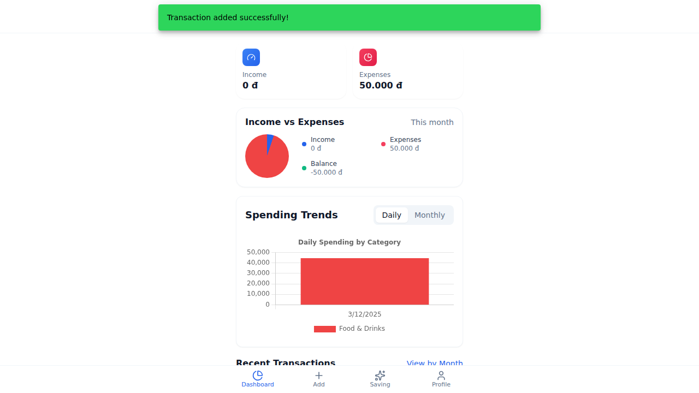

# SmartMoney - Personal Finance Manager

> A slack hand causes poverty, but the hand of the diligent makes rich. *(Proverbs 10:4, NRSVue)*

> The plans of the diligent lead surely to abundance, but everyone who is hasty comes only to want. *(Proverbs 21:5, NRSVue)*

Our app is based on these two fundamental truths.

Built with React (Ionic), TypeScript, and IndexedDB. A local-first, privacy-focused application.

## ✨ Key Features

### 💰 Transaction Management
- **Manual Entry**: Easily add income and expenses.
- **Date & Time Modification**: Record transactions for any date and time.
- **Month-by-Month View**: Filter and view transactions by specific months.
- **Real-time Balance**: Automatic calculation of income, expenses, and available balance.
- **Transaction History**: View, edit, and delete past transactions.

### 📊 Spending Analytics
- **Spending Trends**: Visualize your spending habits with daily and monthly stacked bar charts.
- **Category Breakdown**: Understand where your money goes.

### 🎯 Saving Goals
- **Goal Tracking**: Set targets, track progress, and dedicate funds from your balance.
- **Priority Management**: Organize goals by priority (Low, Medium, High).

### 📊 Budget Management
- **Category Budgets**: Set monthly spending limits per category.
- **Real-time Tracking**: Automatically calculated from transactions.
- **Visual Progress**: See at a glance if you are nearing your limits.

### 🔔 Notifications
- **Local Alerts**: Get notified about budget limits and other app events.

### 🔐 Security & Privacy
- **Local Storage**: All data is stored locally on your device using IndexedDB.
- **No Backend**: No data is sent to external servers. Your financial data stays with you.

## 📸 Screenshots

### Dashboard & Analytics

<table>
  <tr>
    <td align="center">
      <br/>
      <sub><b>Dashboard</b></sub><br/>
      <sub>Overview of balance and trends</sub>
    </td>
    <td align="center">
      <br/>
      <sub><b>Spending Trends</b></sub><br/>
      <sub>Daily and monthly visualization</sub>
    </td>
  </tr>
</table>

### Transaction Management

<table>
  <tr>
    <td align="center">
      <br/>
      <sub><b>Add Transaction</b></sub><br/>
      <sub>Record expense with date selection</sub>
    </td>
    <td align="center">
      <br/>
      <sub><b>Monthly View</b></sub><br/>
      <sub>Filter transactions by month</sub>
    </td>
  </tr>
</table>

## 🚀 Quick Start

### Local Development

**1. Setup Frontend**
```bash
cd Frontend-MoneyTrack
npm install
npm run dev
# App runs on http://localhost:5173
```

## 📋 Prerequisites

### Required
- **Node.js**: v20 or later
- **npm**: v10 or later

## 📁 Project Structure

```
Frontend-MoneyTrack/          # ⚛️ React + Ionic Frontend
├── src/
│   ├── pages/               # Page components
│   │   ├── dashboard/       # Main app pages
│   │   │   ├── Dashboard.tsx
│   │   │   ├── AddTransaction.tsx
│   │   │   ├── TransactionsByMonth.tsx
│   │   │   └── ...
│   ├── services/            # API & state management
│   │   ├── api.ts          # API layer (IndexedDB wrapper)
│   │   ├── db.ts           # IndexedDB configuration
│   │   └── BalanceContext.tsx
│   └── components/          # Reusable UI components
│       └── dashboard/
│           └── SpendingTrends.tsx
└── package.json
```

## 🔧 Technology Stack

### Frontend
- React 18, TypeScript, Ionic Framework 8
- Vite, Tailwind CSS, Lucide Icons
- IndexedDB (via `idb`) for local storage
- Chart.js & React Chartjs 2 for visualization

## 📖 Documentation

- **[User Guide](docs/user-guide/getting-started.md)** - How to use SmartMoney
- **[Developer Guide](docs/developer-guide/setup.md)** - Setup and development

## 🧪 Development

### Running Tests

```bash
# Frontend unit tests
cd Frontend-MoneyTrack
npm run test.unit

# Frontend E2E tests
npm run test.e2e
```

### Code Quality

```bash
# Lint frontend
cd Frontend-MoneyTrack
npm run lint

# Build and check
npm run build
```

## 🤝 Contributing

We welcome contributions! Here's how to get started:

1. Fork the repository
2. Create a feature branch (`git checkout -b feature/amazing-feature`)
3. Make your changes
4. Run tests and linting
5. Commit your changes (`git commit -m 'Add amazing feature'`)
6. Push to your fork (`git push origin feature/amazing-feature`)
7. Open a Pull Request

## 📝 License

MIT License - See [LICENSE](LICENSE) file for details.

---

<p align="center">
  Built with ❤️ by Team Vineyard Workers
</p>

<p align="center">
  <strong>SmartMoney</strong> - Intelligent Personal Finance Management
</p>
