# SmartMoney - AI-Powered Personal Finance Manager

> An intelligent personal finance application that helps you track expenses, manage budgets, and achieve your savings goals with AI-powered insights.

Built with React (Ionic), Express, TypeScript, and MongoDB. Powered by Naver Clova AI services.

## ✨ Key Features

### 💰 Transaction Management
- **Multiple Input Methods**: Manual entry, receipt scanning (OCR), and voice input (STT)
- **Smart Categorization**: AI-powered expense categorization
- **Real-time Balance**: Automatic calculation of income, expenses, and available balance
- **Transaction History**: View, edit, and delete past transactions

### 🎯 Saving Goals & AI Plans
- **Goal Tracking**: Set targets, track progress, dedicate funds from balance
- **AI-Generated Plans**: Personalized savings recommendations powered by Naver Clova Studio HCX-007
- **Smart Proposals**: AI suggests new goals and optimal budget limits
- **Streaming Generation**: Real-time progress updates with reconnection support

### 📊 Budget Management
- **Category Budgets**: Set monthly spending limits per category
- **Real-time Tracking**: Automatically calculated from transactions
- **Smart Alerts**: Notifications at 80% threshold
- **AI Optimization**: Get budget suggestions from AI analysis

### 🔔 Intelligent Notifications
- Budget warnings when reaching 80% of limit
- High spending alerts relative to income
- Goal progress updates
- Mark as read/unread

### 🔐 Security & Privacy
- **Two-layer Hashing**: argon2id (client) + SHA256 (server)
- **Token Authentication**: Secure API access
- **Site-specific Salt**: Prevents password database comparison attacks
- **Python Sandbox**: Isolated AI code execution with Firejail

## 📸 Screenshots

### Authentication & Onboarding

<table>
  <tr>
    <td align="center">
      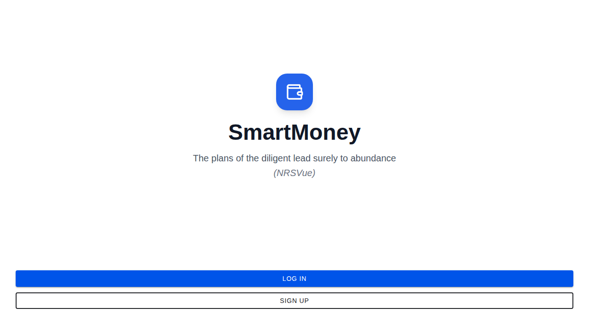<br/>
      <sub><b>Splash Screen</b></sub>
    </td>
    <td align="center">
      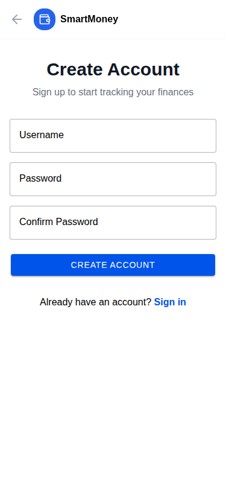<br/>
      <sub><b>Sign Up</b></sub>
    </td>
    <td align="center">
      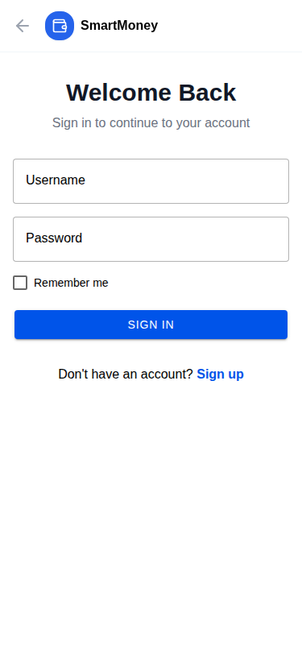<br/>
      <sub><b>Sign In</b></sub>
    </td>
  </tr>
</table>

### Dashboard & Overview

<table>
  <tr>
    <td align="center">
      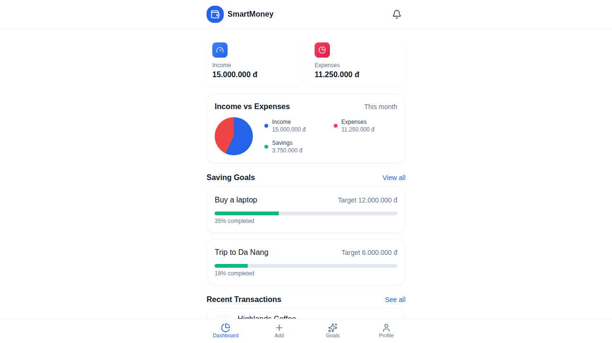<br/>
      <sub><b>Dashboard - Main View</b></sub><br/>
      <sub>Income, Expenses, Balance Overview</sub>
    </td>
    <td align="center">
      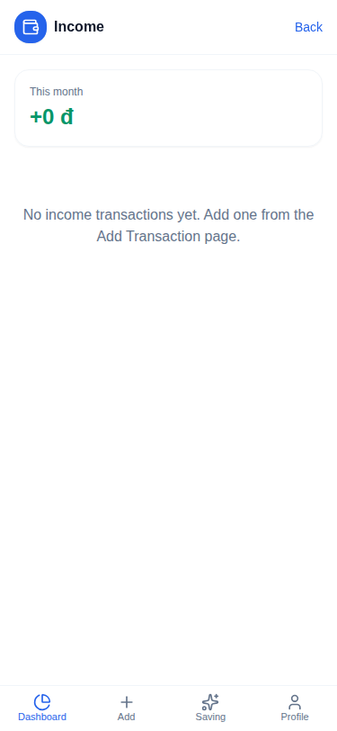<br/>
      <sub><b>Income List</b></sub><br/>
      <sub>View all income transactions</sub>
    </td>
    <td align="center">
      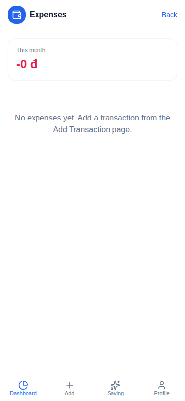<br/>
      <sub><b>Expenses List</b></sub><br/>
      <sub>View and manage expenses</sub>
    </td>
  </tr>
</table>

### Transaction Management

<table>
  <tr>
    <td align="center">
      <br/>
      <sub><b>Add Transaction (Manual)</b></sub><br/>
      <sub>Manual entry with category selection</sub>
    </td>
    <td align="center">
      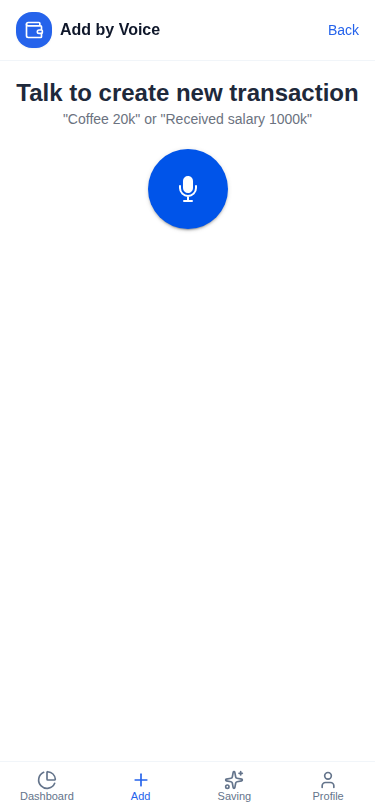<br/>
      <sub><b>Add by Voice (STT)</b></sub><br/>
      <sub>Speech-to-text transaction entry</sub>
    </td>
    <td align="center">
      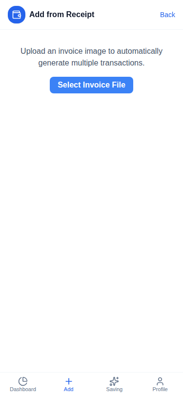<br/>
      <sub><b>Add by Receipt (OCR)</b></sub><br/>
      <sub>Scan receipts for bulk entry</sub>
    </td>
  </tr>
  <tr>
    <td align="center">
      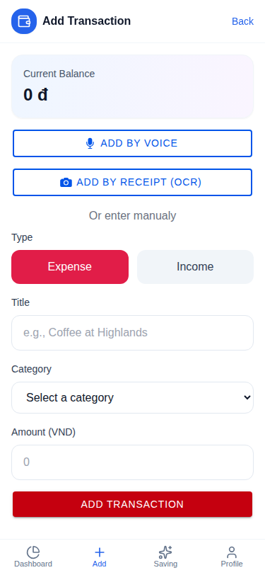<br/>
      <sub><b>Edit Transaction</b></sub><br/>
      <sub>Modify or delete transactions</sub>
    </td>
  </tr>
</table>

### Budget Management

<table>
  <tr>
    <td align="center">
      <br/>
      <sub><b>Budget Overview</b></sub><br/>
      <sub>Set and track category budgets</sub>
    </td>
    <td align="center">
      <br/>
      <sub><b>Create Budget</b></sub><br/>
      <sub>Add new monthly budget limits</sub>
    </td>
    <td align="center">
      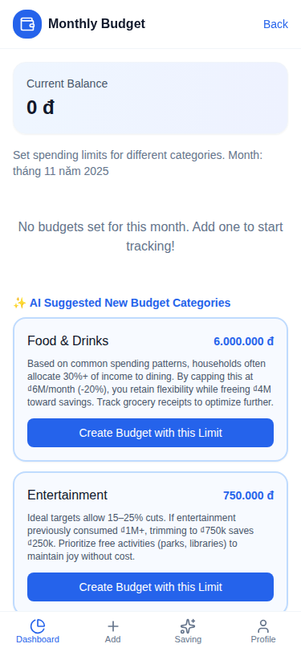<br/>
      <sub><b>AI Budget Proposals</b></sub><br/>
      <sub>Get AI-powered budget recommendations</sub>
    </td>
  </tr>
</table>

### Savings Goals & AI Planning

<table>
  <tr>
    <td align="center">
      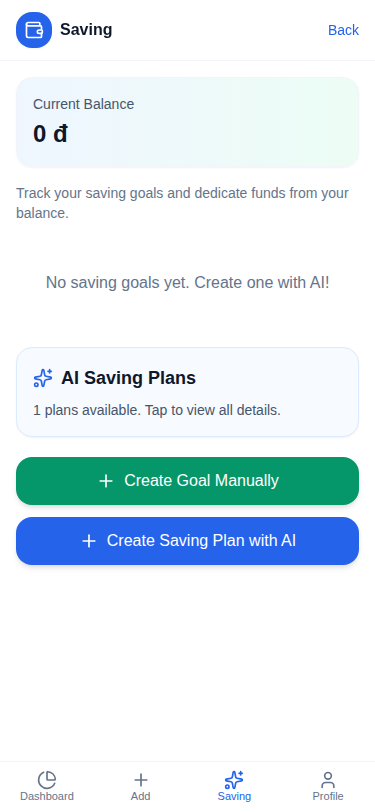<br/>
      <sub><b>Saving Goals</b></sub><br/>
      <sub>Track progress on savings goals</sub>
    </td>
    <td align="center">
      <br/>
      <sub><b>AI Savings Wizard</b></sub><br/>
      <sub>Step-by-step AI plan generation</sub>
    </td>
    <td align="center">
      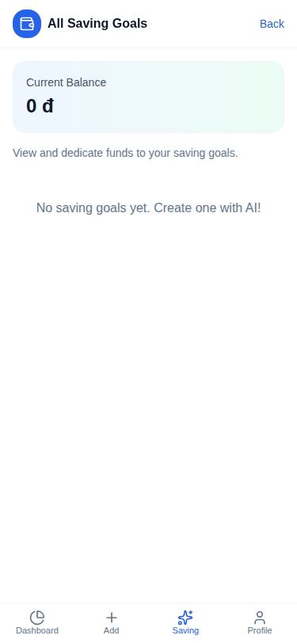<br/>
      <sub><b>All Goals</b></sub><br/>
      <sub>Complete list of savings goals</sub>
    </td>
  </tr>
  <tr>
    <td align="center">
      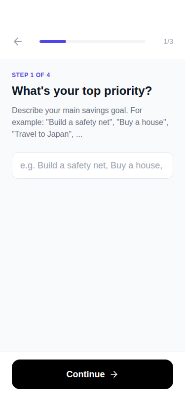<br/>
      <sub><b>Savings Plan Detail</b></sub><br/>
      <sub>AI recommendations with reasoning</sub>
    </td>
    <td align="center">
      <br/>
      <sub><b>All Savings Plans</b></sub><br/>
      <sub>View all AI-generated plans</sub>
    </td>
  </tr>
</table>

### Notifications & Profile

<table>
  <tr>
    <td align="center">
      <br/>
      <sub><b>Notifications</b></sub><br/>
      <sub>Budget alerts and goal updates</sub>
    </td>
    <td align="center">
      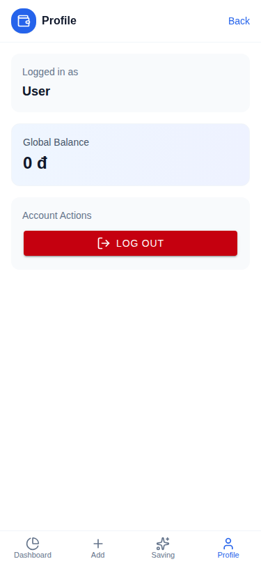<br/>
      <sub><b>Profile & Settings</b></sub><br/>
      <sub>Account information and logout</sub>
    </td>
  </tr>
</table>

> **Note**: Some screenshots above use onerror handlers to gracefully hide missing images. To update screenshots, replace the existing files or add new ones in the `/screenshots` folder with the numbered naming convention.

## 🚀 Quick Start

### Option 1: Docker (Recommended)

The fastest way to run SmartMoney with all services:

```bash
# Clone the repository
git clone https://github.com/huynhtrankhanh/naver-hackathon-vineyard-workers.git
cd naver-hackathon-vineyard-workers

# Start all services
docker compose up -d

# Access the app at http://localhost:3001
```

**What's included:**
- ✅ MongoDB database with persistent storage
- ✅ Combined frontend + backend server
- ✅ Automatic restart on failure
- ✅ No manual dependency installation

See [Docker Deployment Guide](docs/deployment/docker.md) for details.

### Option 2: Local Development

For development with hot reload:

**1. Setup Backend**
```bash
cd backend
npm install
cp .env.example .env
# Edit .env with your API keys (optional)
npm run dev
# Backend runs on http://localhost:3001
```

**2. Setup Frontend** (in new terminal)
```bash
cd Frontend-MoneyTrack
npm install
npm run dev
# Frontend runs on http://localhost:5173
```

**3. Open App**
- Frontend: http://localhost:5173
- Backend API: http://localhost:3001/api

See [Developer Setup Guide](docs/developer-guide/setup.md) for detailed instructions.

## 📋 Prerequisites

### Required
- **Node.js**: v20 or later
- **npm**: v10 or later

### Optional
- **MongoDB**: v7.0+ (app uses MongoDB Memory Server by default)
- **Docker & Docker Compose**: For containerized deployment
- **Naver Cloud Platform Account**: For AI features (OCR, STT, Clova Studio)
## 📁 Project Structure

```
naver-hackathon-vineyard-workers/
├── docs/                          # 📚 Documentation
│   ├── user-guide/               # User documentation
│   ├── developer-guide/          # Developer documentation
│   ├── api-reference/            # API reference
│   └── deployment/               # Deployment guides
│
├── Frontend-MoneyTrack/          # ⚛️ React + Ionic Frontend
│   ├── src/
│   │   ├── pages/               # Page components
│   │   │   ├── splash.tsx
│   │   │   ├── SignIn.tsx
│   │   │   ├── SignUp.tsx
│   │   │   ├── SavingsOnboarding.tsx  # AI wizard
│   │   │   └── dashboard/       # Main app pages
│   │   ├── services/            # API & state management
│   │   │   ├── api.ts          # Backend API client
│   │   │   ├── BalanceContext.tsx
│   │   │   └── stateInvalidation.ts
│   │   └── components/          # Reusable UI components
│   └── package.json
│
├── backend/                      # 🚀 Express + MongoDB Backend
│   ├── src/
│   │   ├── models/              # Mongoose schemas
│   │   │   ├── User.ts
│   │   │   ├── Transaction.ts
│   │   │   ├── Goal.ts
│   │   │   ├── Budget.ts
│   │   │   ├── SavingsPlan.ts
│   │   │   └── Notification.ts
│   │   ├── routes/              # API endpoints
│   │   │   ├── auth.ts
│   │   │   ├── transactions.ts
│   │   │   ├── goals.ts
│   │   │   ├── budgets.ts
│   │   │   ├── ai.ts           # AI services
│   │   │   ├── ocr.ts          # Receipt scanning
│   │   │   └── notifications.ts
│   │   ├── services/            # Business logic
│   │   │   └── clovaOcr.service.ts
│   │   ├── utils/               # Utilities
│   │   │   ├── aiService.ts    # Clova Studio client
│   │   │   ├── aiTools.ts      # AI function tools
│   │   │   ├── clovaClient.ts
│   │   │   ├── pythonSandbox.ts # Firejail isolation
│   │   │   └── ocr.service.ts
│   │   └── server.ts           # Main server
│   └── package.json
│
├── screenshots/                  # 📸 App screenshots
├── docker-compose.yml           # 🐳 Docker setup
├── Dockerfile                   # Container definition
└── README.md                    # This file
```

See [Architecture Overview](docs/developer-guide/architecture.md) for detailed system design.
## 🤖 AI Integration

SmartMoney uses **Naver Clova Studio HCX-007** model with high reasoning effort to generate personalized saving plans.

### How AI Works

1. **Data Analysis**: AI reviews your transaction history, budgets, goals, and income
2. **Tool Usage**: AI has access to 7 function tools to query your financial data
3. **Plan Generation**: Creates personalized recommendations with reasoning
4. **Proposals**: Suggests new saving goals and optimal budget limits

### AI Features

- **Receipt Scanning**: Naver Clova OCR extracts transaction data from images
- **Voice Input**: Naver Clova X STT converts speech to text
- **Smart Categorization**: AI categorizes expenses automatically
- **Saving Plans**: Personalized monthly savings targets and spending recommendations
- **Budget Optimization**: AI suggests category-specific budget limits

### Intensity Levels

- **Just starting out**: Conservative (60-90% of goal)
- **Ideal target**: Balanced (90-110% of goal) - Recommended
- **Must achieve**: Aggressive (110-140% of goal)

### Streaming & Reconnection

- Real-time progress updates via Server-Sent Events (SSE)
- Can close app during generation and reconnect later
- Generation sessions persist until completed

See [User Guide - AI Savings](docs/user-guide/features.md#ai-generated-saving-plans) for more details.

## 🔧 Technology Stack

### Frontend
- React 18, TypeScript, Ionic Framework 8
- Vite, Tailwind CSS, Lucide Icons
- libsodium-wrappers (argon2id hashing)
- React Router, React Markdown

### Backend
- Express.js 4, TypeScript, Node.js 20+
- MongoDB 7+ with Mongoose ODM
- MongoDB Memory Server (dev/test)
- Naver Clova Studio (HCX-007)
- Naver Clova OCR & STT
- Firejail (Python sandbox)
- OpenAI-compatible client, Axios

### DevOps
- Docker & Docker Compose
- tsx (TypeScript execution)
- ESLint, Vitest, Cypress

See [Architecture Overview](docs/developer-guide/architecture.md) for system design details.

## 📖 Documentation

- **[User Guide](docs/user-guide/getting-started.md)** - How to use SmartMoney
- **[Developer Guide](docs/developer-guide/setup.md)** - Setup and development
- **[API Reference](docs/api-reference/endpoints.md)** - Complete API documentation
- **[Architecture](docs/developer-guide/architecture.md)** - System design and architecture
- **[Deployment](docs/deployment/docker.md)** - Docker deployment guide
- **[State Management](docs/developer-guide/state-management.md)** - Frontend state system

## 🔐 Security

### Password Security ("Server Relief" Strategy)

**Two-Layer Hashing:**

1. **Client-side** (argon2id via libsodium):
   - Password hashed with argon2id algorithm
   - Salt derived from: username + site-specific salt
   - Memory: 19MB, Iterations: 2, Parallelism: 1
   - Output: 64-character hex string

2. **Server-side** (SHA256):
   - Server receives argon2id hash (never plaintext password)
   - Applies SHA256 to the received hash
   - Stores SHA256 hash in database

**Benefits:**
- ✅ Heavy computation runs on client (reduces server load)
- ✅ Rainbow table resistance (username-derived salt)
- ✅ Cross-site protection (site-specific salt)
- ✅ No plaintext passwords ever transmitted or stored

### Protected Resources

- All API endpoints (except auth) require authentication
- Token-based authentication with Bearer scheme
- User data isolated by userId (no cross-user access)
- AI sandbox with resource limits (6s timeout, 256MB RAM)

### Best Practices

- ✅ Environment variables for sensitive config
- ✅ Input validation on all endpoints
- ✅ CORS properly configured
- ✅ No secrets in codebase
- ⚠️ Rate limiting not implemented (future enhancement)
- ⚠️ Token expiration not implemented (future enhancement)

See [Security Guide](docs/developer-guide/architecture.md#security-architecture) for details.

## 🧪 Development

### Running Tests

```bash
# Frontend unit tests
cd Frontend-MoneyTrack
npm run test.unit

# Frontend E2E tests
npm run test.e2e

# Backend tests (future)
cd ../backend
npm test
```

### Code Quality

```bash
# Lint frontend
cd Frontend-MoneyTrack
npm run lint

# Build and check
npm run build
```

### Environment Setup

**Backend `.env`:**
```env
PORT=3001
NODE_ENV=development
MONGODB_URI=mongodb://localhost:27017/moneytrack

# Optional: Naver Cloud API keys for AI features
CLOVA_API_KEY=your-key
CLOVA_OCR_API_URL=your-url
CLOVA_OCR_SECRET_KEY=your-key
NAVER_CLIENT_ID=your-id
NAVER_CLIENT_SECRET=your-secret
```

**Frontend `.env` (optional):**
```env
VITE_API_URL=http://localhost:3001/api
```

## 🚀 Deployment

### Docker Deployment

See [Docker Deployment Guide](docs/deployment/docker.md) for:
- Multi-container setup with MongoDB
- Persistent data volumes
- Environment configuration
- Production best practices

### Manual Deployment

1. Build frontend: `cd Frontend-MoneyTrack && npm run build`
2. Build backend: `cd backend && npm run build`
3. Configure environment variables
4. Set up MongoDB instance
5. Run backend: `npm start`
6. Serve frontend build with nginx or similar

## 🗺️ Roadmap

### Completed ✅
- [x] User authentication with secure hashing
- [x] Transaction tracking (manual, OCR, STT)
- [x] Budget management with real-time tracking
- [x] Saving goals with AI-generated plans
- [x] Notifications system
- [x] State management and sync
- [x] Docker deployment
- [x] Comprehensive documentation

### In Progress 🔄
- [ ] Password reset functionality
- [ ] Export data (CSV/PDF)
- [ ] Enhanced analytics

### Future Enhancements 🔮
- [ ] Two-factor authentication
- [ ] Push notifications (PWA)
- [ ] Multi-currency support
- [ ] Spending trends and predictions
- [ ] Bill reminders
- [ ] Investment tracking
- [ ] Mobile apps (React Native/Capacitor)
- [ ] WebSocket real-time updates
- [ ] GraphQL API

## 🤝 Contributing

We welcome contributions! Here's how to get started:

1. Fork the repository
2. Create a feature branch (`git checkout -b feature/amazing-feature`)
3. Make your changes
4. Run tests and linting
5. Commit your changes (`git commit -m 'Add amazing feature'`)
6. Push to your fork (`git push origin feature/amazing-feature`)
7. Open a Pull Request

See [Contributing Guide](docs/developer-guide/contributing.md) for detailed guidelines.

## 📝 License

MIT License - See [LICENSE](LICENSE) file for details.

## 👥 Team & Contributions

**Naver Hackathon - Vineyard Workers**

### Core Team Members

#### **Huỳnh Trần Khanh** ([@huynhtrankhanh](https://github.com/huynhtrankhanh))
*Project Lead, Full-Stack Developer & System Architect*

**Major Contributions:**
- **Project Foundation & Architecture**: Initial repository setup, project specification, and foundational documents
- **Backend Infrastructure**: MongoDB integration, authentication system redesign, session management
- **Frontend Core**: Sign-in/Sign-up UI enhancements, splash screen design, dashboard improvements
- **Security Implementation**: Two-layer password hashing (argon2id + SHA256), secure authentication flow
- **AI Integration Management**: Coordinated AI-powered features integration, savings plan system, Clova Studio HCX-007 setup
- **Currency & Localization**: Unified currency to VND across the application, receipt price conversion
- **State Management**: Balance synchronization fixes, state invalidation system
- **Documentation**: Comprehensive README, API documentation, deployment guides, security documentation
- **DevOps**: Docker containerization, MongoDB Memory Server configuration, environment setup
- **Code Review & Quality**: Managed 35+ pull requests, coordinated GitHub Copilot agent work

**Key Files**: Project architecture, server configuration, authentication routes, database models, documentation structure

---

#### **Nguyễn Đỗ Chiến Thắng** ([@thang7112001](https://github.com/thang7112001))
*Backend Developer & Database Architect*

**Major Contributions:**
- **Initial Backend Setup**: Project scaffolding with Node.js/Express, TypeScript configuration
- **Database Design**: MongoDB schema design for Users and Transactions, database connection setup
- **CRUD Operations**: Complete REST API for user and transaction management
- **Authentication Backend**: Initial user registration and login API endpoints
- **Voice-to-Text Integration**: Speech-to-text API using Naver Clova X STT service
- **Voice Transaction Feature**: Automatic transaction creation from voice input
- **Code Quality**: ESLint configuration and code style setup
- **Frontend Bootstrap**: Initial sign-in/sign-up UI components with Ionic Framework

**Key Files**: `backend/src/routes/transactions.ts`, `backend/src/routes/auth.ts` (initial version), `backend/src/models/User.ts`, database connection logic, STT integration

---

#### **Trần Đức Mạnh** ([@ducmanhhb2005](https://github.com/ducmanhhb2005))
*AI/ML Engineer & OCR Specialist*

**Major Contributions:**
- **OCR Implementation**: Receipt scanning functionality using Naver Clova OCR
- **LLM Integration**: Receipt data extraction using Clova HCX-005 vision model
- **Image Processing Pipeline**: Receipt image upload, analysis, and structured data extraction
- **OCR-to-Transaction Flow**: Automated transaction creation from scanned receipts
- **Currency Detection**: Intelligent USD/VND detection and conversion in receipts
- **API Testing**: Comprehensive testing of OCR endpoints and data flow

**Key Files**: `backend/src/utils/clovaX.service.ts`, `backend/src/routes/ocr.ts`, `backend/src/services/clovaOcr.service.ts`, receipt processing utilities

---

#### **Nguyễn Hà Nam Trân** ([@namtran1205](https://github.com/namtran1205))
*Frontend Developer & UI/UX Specialist*

**Major Contributions:**
- **Savings Plan Frontend**: Complete UI/UX for AI-generated savings plans
- **Goals Management Pages**: Created `GoalsAll.tsx` and `SavingPlansAll.tsx` for comprehensive goal viewing
- **Notification System**: Built entire notification feature including backend integration
- **Transaction Editing**: Enhanced expense viewing, editing, and detail screens
- **Frontend-Backend Integration**: Connected savings plan AI with frontend display
- **Transaction Enhancements**: Improved `AddTransaction.tsx` with category suggestions and validation
- **Data Synchronization**: Savings plan state management and Goal model updates

**Key Files**: `Frontend-MoneyTrack/src/pages/dashboard/GoalsAll.tsx`, `Frontend-MoneyTrack/src/pages/dashboard/SavingPlansAll.tsx`, `Frontend-MoneyTrack/src/pages/dashboard/Notification.tsx`, `Frontend-MoneyTrack/src/pages/dashboard/Expenses.tsx` (enhancements), savings plan UI components

---

### AI Development Assistance

**GitHub Copilot** - Code completion and development acceleration  
**ChatGPT (OpenAI)** - Architecture design and problem-solving  
**Gemini 2.5 Pro (Google)** - Documentation and code review

*Note: All GitHub Copilot agent commits were initiated, reviewed, and approved by the team members. The automation assisted with implementation, but design decisions and code quality remained under human oversight.*

## 🙏 Acknowledgments

- **Naver Hackathon** for the opportunity
- **Naver Cloud Platform** for AI services (Clova Studio, OCR, STT)
- **Ionic Framework** for mobile UI components
- **MongoDB** for the database
- **Express.js** for the backend framework
- Open source community for amazing tools and libraries

## 📞 Support

- **Documentation**: [docs/README.md](docs/README.md)
- **Issues**: [GitHub Issues](https://github.com/huynhtrankhanh/naver-hackathon-vineyard-workers/issues)
- **Discussions**: [GitHub Discussions](https://github.com/huynhtrankhanh/naver-hackathon-vineyard-workers/discussions)

---

<p align="center">
  Built with ❤️ by Team Vineyard Workers
</p>

<p align="center">
  <strong>SmartMoney</strong> - Intelligent Personal Finance Management
</p>
